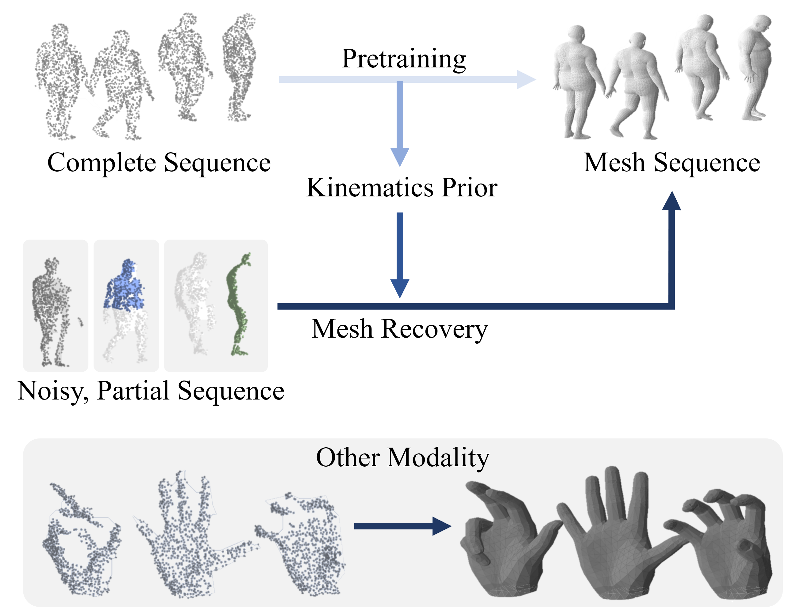

# Geometry-Aware Scene Configurations for Novel View Synthesis

Official code for **"Geometry-Aware Scene Configurations for Novel View Synthesis"**
accepted to **IEEE Transactions on Visualization and Computer Graphics (TVCG) 2026**.

[Minkwan Kim](https://mkjjang3598.github.io) · [Changwoon Choi](https://changwoon.info) · [Young Min Kim](http://3d.snu.ac.kr/members)

Seoul National University

[](https://arxiv.org/abs/2510.09880)
[](https://mkjjang3598.github.io/Geo-Scene-Config)
[](https://drive.google.com/file/d/1TtywOgYCZ5TTXqMzdnXBOWrIGI7TFb28/view?usp=sharing)
[](https://www.youtube.com/watch?v=U5001zsHz6w)

---

## Overview

We propose scene-adaptive strategies to efficiently allocate representation capacity for generating immersive experiences of indoor environments from incomplete observations. Indoor scenes with multiple rooms often exhibit irregular layouts with varying complexity, containing clutter, occlusion, and flat walls. We maximize the utilization of limited resources with guidance from geometric priors, which are often readily available after pre-processing stages. We record observation statistics on the estimated geometric scaffold and guide the optimal placement of bases, greatly improving upon the uniform basis arrangements adopted by previous scalable scene representations. We also suggest scene-adaptive virtual viewpoints to compensate for geometric deficiencies inherent in view configurations in the input trajectory. We present a comprehensive analysis demonstrating significant enhancements compared to baselines that employ regular placements.



---

## Repository Structure

```
Geo-Scene-Config/
├── map-anything/   # Feed-forward metric 3D reconstruction (geometry & depth)
├── nelf-pro/       # Neural Light Field Probes (novel view synthesis)
├── localrf/        # Progressive local radiance fields (large-scale scenes)
└── scripts/        # Dataset-specific training & preprocessing scripts
    ├── experiments/
    ├── scannetpp/
    ├── kitti360/
    ├── scuol/
    ├── tanks/
    └── zipnerf/
```

---

## Installation
> We used a conda environment (`geometry_basis`). Install PyTorch with CUDA 11.3 first, then install each submodule with `pip install -e .`.
---

### 1. Clone with submodules

```bash
git clone --recurse-submodules https://github.com/mkjjang3598/Geo-Scene-Config.git
cd Geo-Scene-Config
```

### 2. Create conda environment

```bash
conda create -n geometry_basis python=3.8
conda activate geometry_basis
```

### 3. Install PyTorch (CUDA 11.3)

```bash
pip install torch==1.12.1+cu113 torchvision==0.13.1+cu113 --extra-index-url https://download.pytorch.org/whl/cu113
```

### 4. NeLF-Pro

```bash
cd nelf-pro
pip install -e .
cd ..
```

### 5. MapAnything

```bash
cd map-anything
pip install -e .
cd ..
```

---

## Dataset

Download from [Google Drive](https://drive.google.com/file/d/1TtywOgYCZ5TTXqMzdnXBOWrIGI7TFb28/view?usp=sharing) and extract to `data/`.

Supported datasets: ScanNet++ & ZipNeRF (TODO).

Expected layout:
```
data/
└── scannetpp/
    └── <scene_id>/
        └── dslr/
```

---

## Usage

Set up environment variables for your scene (example: ScanNet++ scene `e91722b5a3`):

```bash
DATA_DIR=data/scannetpp
SCENE=e91722b5a3
GPU=0
IMAGE_PATH=../${DATA_DIR}/${SCENE}
TRANSFORMS_PATH=transforms_undistorted_mapanything.json
```

### 1. MapAnything — Geometry Reconstruction

```bash
# Extract per-frame depth maps
python map-anything/scripts/demo_inference_on_colmap_outputs.py \
    --colmap_path ${IMAGE_PATH}/dslr \
    --output_directory ${IMAGE_PATH}/dslr \
    --save_depthmaps

# Build GLB mesh
python map-anything/scripts/demo_inference_on_colmap_outputs.py \
    --colmap_path ${IMAGE_PATH}/dslr \
    --save_glb \
    --output_directory ${IMAGE_PATH}/dslr \
    --apply_mask \
    --stride 4
```

### 2. Basis Optimization & Depth Sampling

> **Order matters** — run in the sequence below.

```bash
cd nelf-pro

# Sample candidate viewpoints
CUDA_VISIBLE_DEVICES=${GPU} ns-sample-viewpoint \
    --data ${IMAGE_PATH} \
    --meshfile ${IMAGE_PATH}/dslr/mapanything_colmap_output.glb \
    --num_candidate_cameras 500 \
    --num_sample_cameras 50 \
    --no-visualize

# Render depth for train / eval / novel splits
CUDA_VISIBLE_DEVICES=${GPU} ns-render-depth \
    --scene ${SCENE} \
    --method mapanything \
    --data ${IMAGE_PATH}/dslr \
    --output_path ${IMAGE_PATH}/dslr \
    --render_option "train" "eval" "novel"

# Optimize probe positions
CUDA_VISIBLE_DEVICES=${GPU} ns-optimize-probe \
    --scene ${SCENE} \
    --method mapanything \
    --data ${IMAGE_PATH}/dslr \
    --transforms_path ${TRANSFORMS_PATH} \
    --no-visualize
```

### 3. NeLF-Pro Training

```bash
# Standard (ScanNet++)
CUDA_VISIBLE_DEVICES=${GPU} ns-train depth-nelf-pro-small \
    --experiment-name mapanything-${SCENE} \
    --vis wandb \
    --raw_loader scannetpp \
    --data ${IMAGE_PATH} \
    --use_probe_optimization True \
    --novel_view True \
    --train_num_rays_per_batch 5120 \
    --use_mapanything True

# With appearance embedding (e.g., scene 0d2ee665be)
CUDA_VISIBLE_DEVICES=${GPU} ns-train depth-nelf-pro-small \
    --experiment-name mapanything-${SCENE} \
    --vis wandb \
    --raw_loader scannetpp \
    --data ${IMAGE_PATH} \
    --use_probe_optimization True \
    --novel_view True \
    --train_num_rays_per_batch 5120 \
    --use_appearance_embedding True \
    --use_mapanything True
```

---

## Citation

```bibtex
@article{kim2026geometry,
  title={Geometry-Aware Scene Configurations for Novel View Synthesis},
  author={Kim, Minkwan and Choi, Changwoon and Kim, Young Min},
  journal={IEEE Transactions on Visualization and Computer Graphics},
  year={2026},
  publisher={IEEE}
}
```

---
## Acknowledgements

This project builds on [NeLF-Pro](https://github.com/sinoyou/nelf-pro), [LocalRF](https://github.com/facebookresearch/localrf), and [MapAnything](https://github.com/facebookresearch/map-anything).
